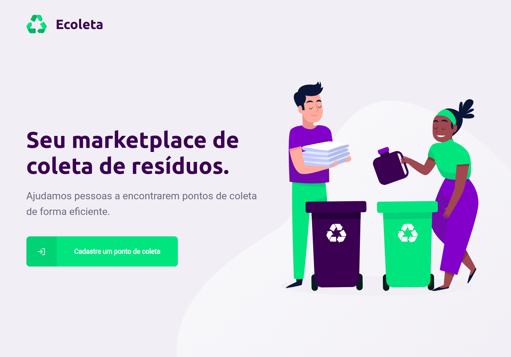
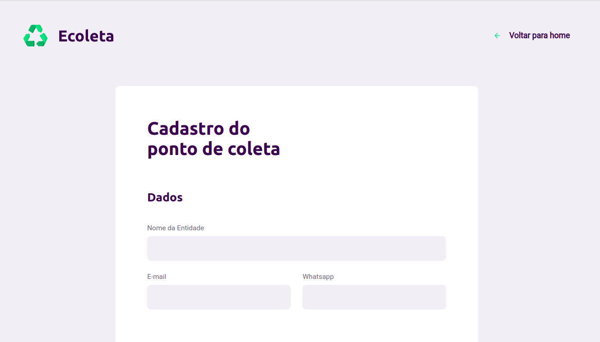
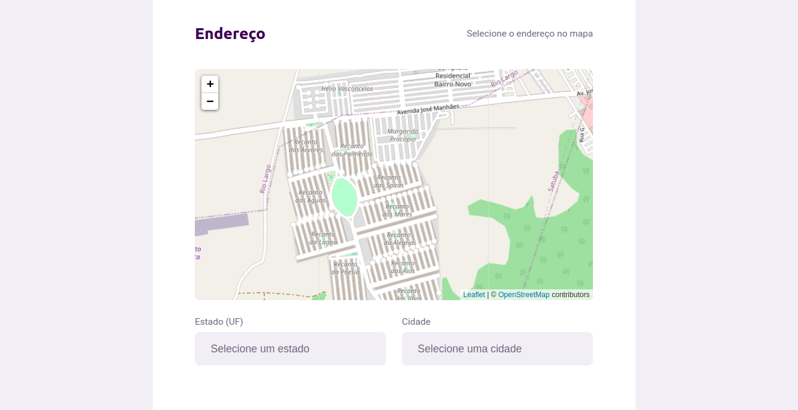
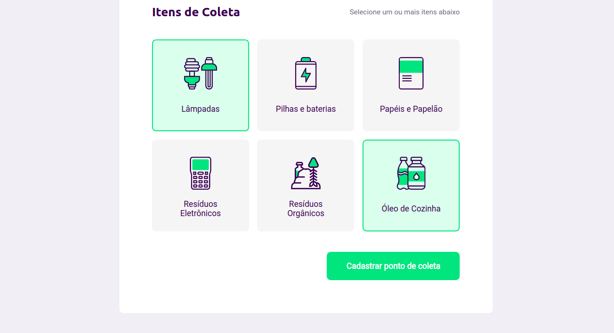

# Ecoleta - Next Level Week

Front-end da aplicação web <strong>Ecoleta</strong>, criado durante o evento <i>Next Level Week</i> (https://nextlevelweek.com/).

### Iniciar projeto 
1. No diretório do seu projeto, instale as dependências com o comando:

`yarn` 

2. Rode o projeto:

`yarn start`
  
3. Acesse a url para ir até a home:
 
 `http://localhost:3000`

### Home

### Criação de ponto de coleta

